# vuepress搭配travis和github pages食用
<tagLink />

## 环境要求

- Node 8.x或以上 （建议使用[nvm](https://github.com/creationix/nvm)管理）
- Windows Git Bash / Mac或Linux 系统命令行工具


## 创建vuepress项目

``` bash
#首先创建一个项目文件夹，并在该文件夹里执行

npm init # 按提示完成初始化项目

npm i -D vuepress@next # 安装vuepress

```
创建docs文件夹，并在docs文件里创建README.md文件，README.md输入任意内容此时的项目机构，如下

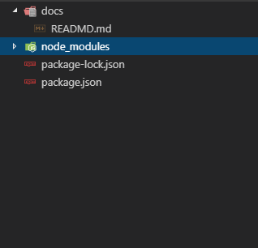

并在package.json文件中增加

``` json
"start": "npm run docs:dev",
"build": "npm run docs:build",
"docs:dev": "vuepress dev docs",
"docs:build": "vuepress build docs"
```

之后，我们就可以执行其中一个命令
``` bash

npm start #启动开发环境

npm run build # 生成dist静态目录，用于生产环境

```

至此，我们创建了一个vuepress项目

::: tip
以上步骤，只是完成一个基本的项目，更多配置请查看[vuepress](https://v1.vuepress.vuejs.org/)官方文档
:::

## 提交到github

::: tip
提交前，请自行到[github.com](https://github.com)建立账号，并在本地安装[git](https://git-scm.com/)
:::

登录到github上，并创建repository

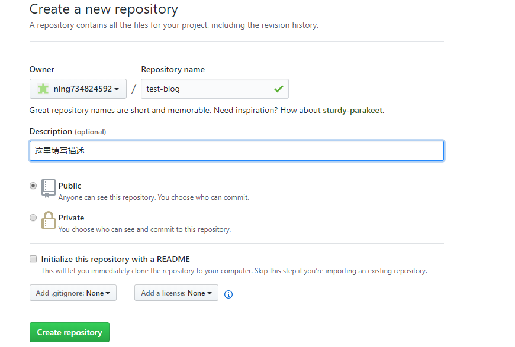


我们先回到项目的根目录，在根目录创建script文件，并在script文件夹内创建build.sh
``` bash
#!/usr/bin/env sh

set -e

npm run build

cd ./docs/.vuepress/dist

git init
git config user.name "${username}"
git config user.email "${useremail}"
git add -A
git commit -m 'deploy'
git push -f https://${token}@github.com/${username}/${repo}.git master:gh-pages

```


``` bash
#初始化git
git init

git remote add origin https://github.com/<USERNAME>/<REPO>.git # <USERNAME>替换成你github的账号名，<REPO>替换成你刚刚创建的repository名称 

git push -u origin master

```

到这里，我们已经把项目提交到gitHub上面去了


## 获取github的 Access token

travis其本身是没有权限，我们需要从我们的github账号中获取

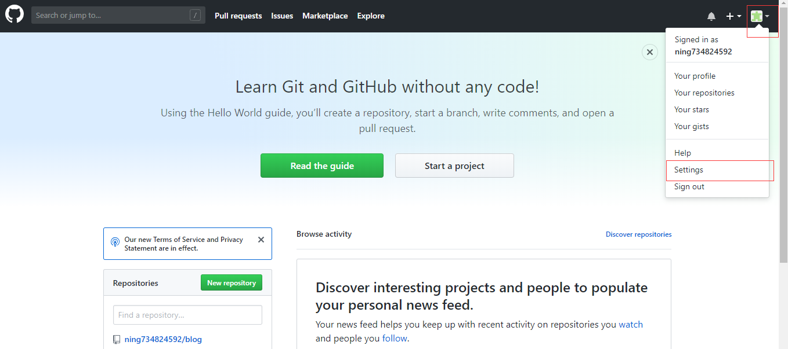


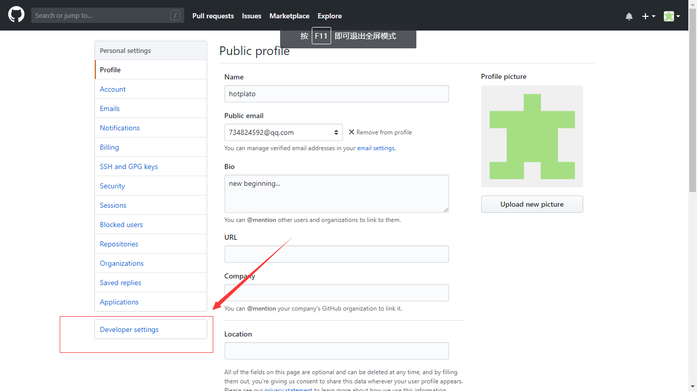


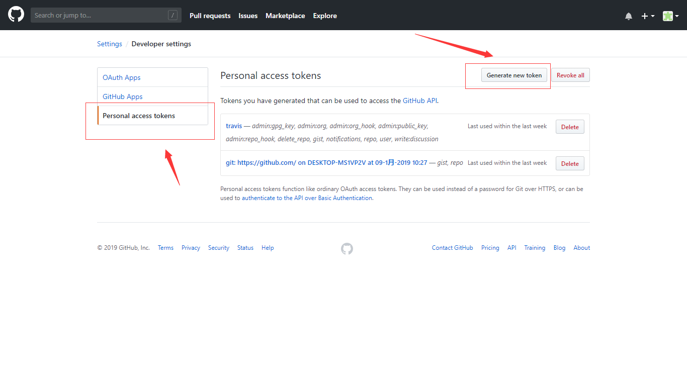


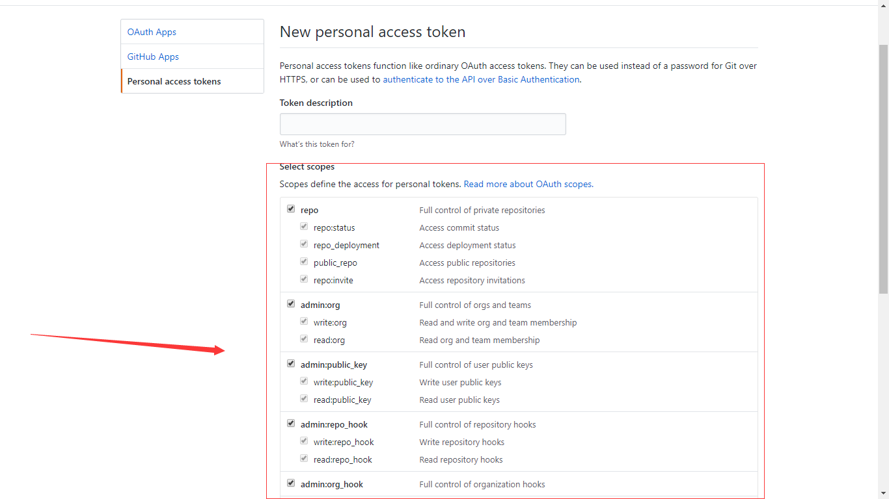

::: tip
获取token的时候，选择权限，最简单就是全部选择，你也可以自己选择需求的权限开放
:::

## 使用travis CLI自动部署项目

为了使平时我们发布博客之后更方便地部署，所以我们配合travis使用，首先我们使用github账号登录到[travis](https://travis-ci.org),并将需要自动部署的项目勾上，如下图

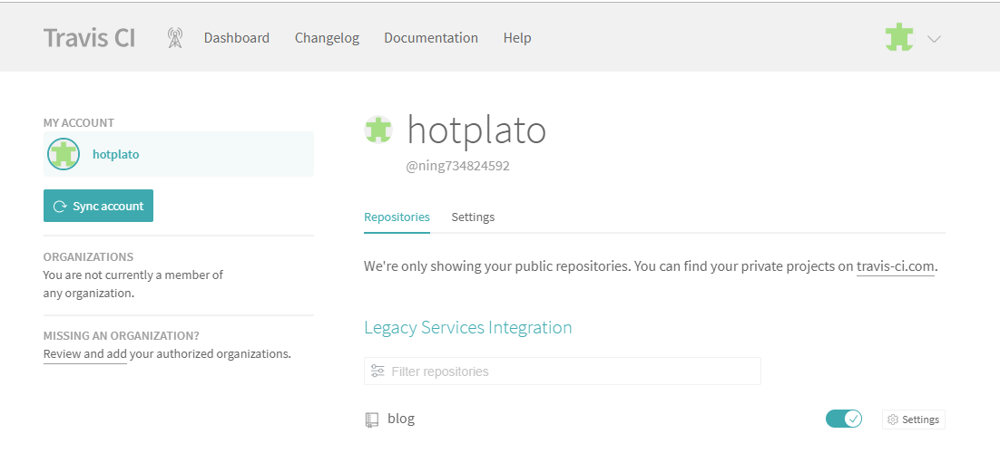

并将所需要的设置，填充到setting中

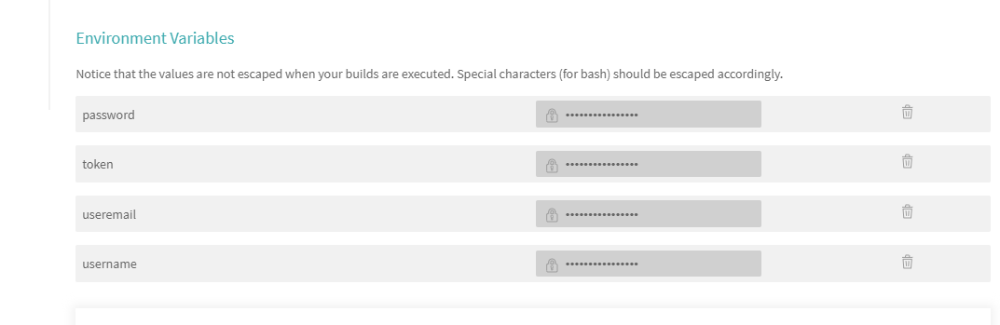

::: danger
注意，添加travis环境变量，敏感信息不要勾选“display value in build log”,这将会显示到log信息中去
:::


并在项目根目录，创建.travis.yml文件

``` yaml
language: node_js
sudo: required
node_js:
  - 10.15.0
cache:
  directories:
    - node_modules
script:
  - ./script/build.sh    
branch: master
```

其它更多配置，请参数[travis文档](https://docs.travis-ci.com/)

## 提交修改，并启用github pages服务

假设已经修改了任意文件，命令行中执行

``` bash

git add -A
git commit -m 'update'
git push

```

我们可以到Travis网站，查看自动部署的日志输出
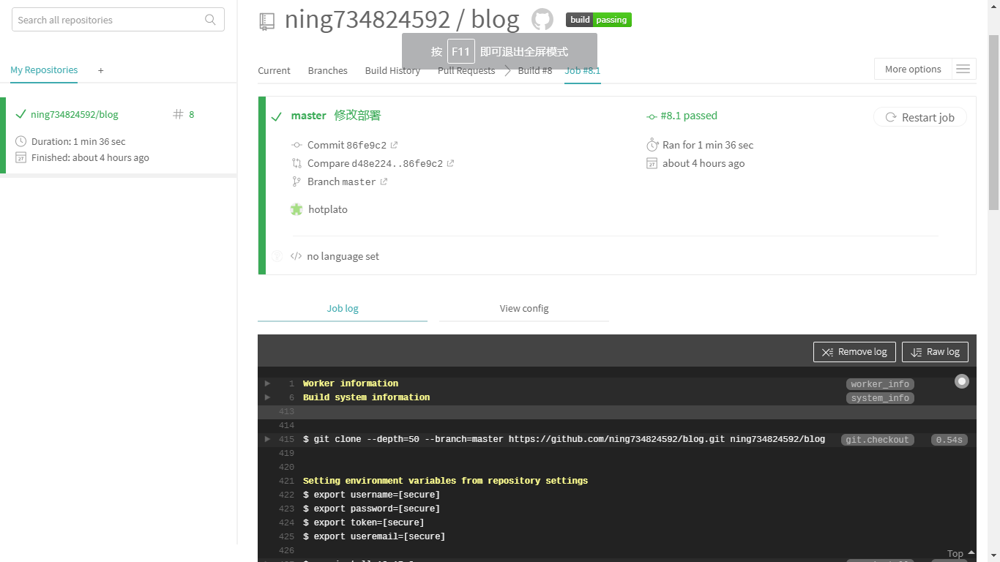

确认travis没有报错，我们github上的项目，已增加了gh-pages分支，我们选择此分支可以看到，编译好的静态文件目录

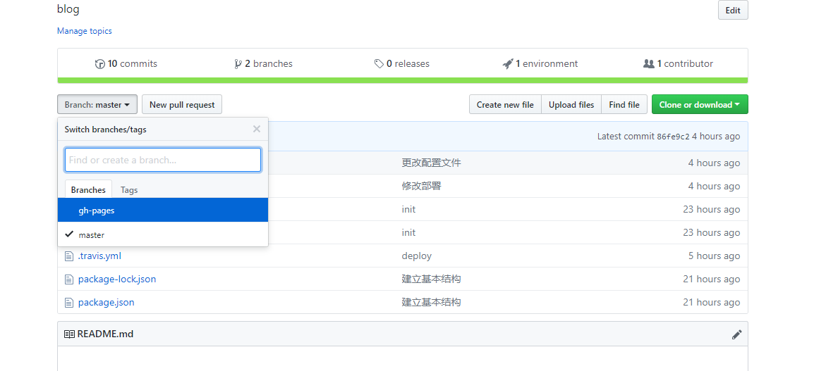

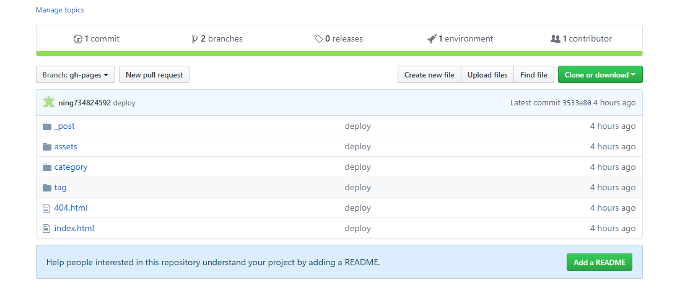

然后按以后步骤找到GitHub Pages服务，并选择当前分支显示


稍等片刻后，我们可以打开https://(USERNAME).github.io/(REPO)/查看，其(USERNAME)替换成你github用户名，(REPO)替换成github的repository名称


## 结语
到此，所有的工作已经完成，如有疑问，可以发邮件到[734824592@qq.com](#)一起讨论
